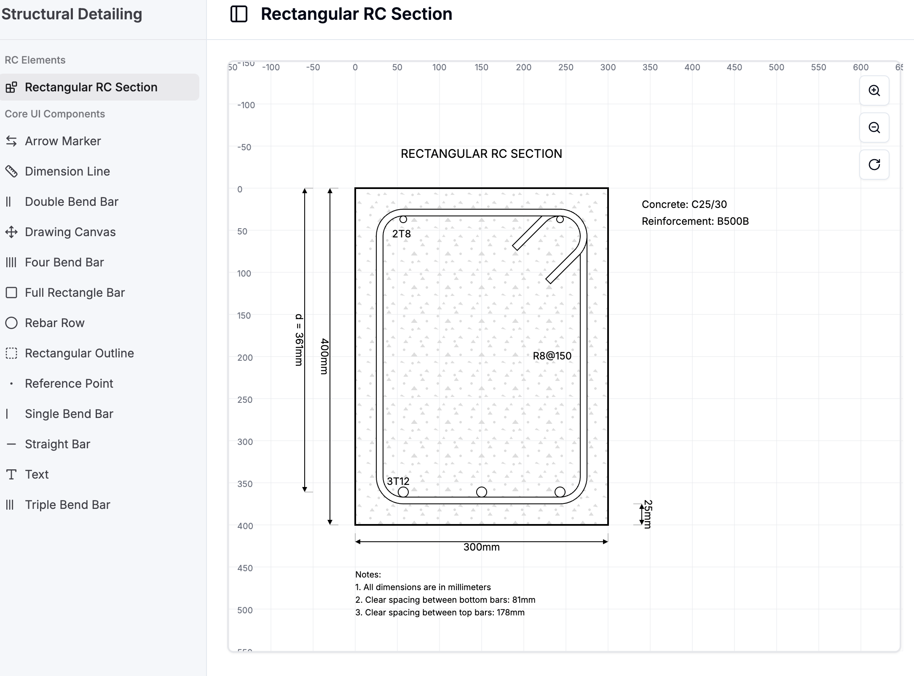

# Parametric Drawings with React & SVG



## Overview

This is an **experimental repository** that showcases the power of React components and SVG to create parametric, interactive technical drawings. Unlike traditional parametric modelling tools like Rhino Grasshopper or Dynamo, this project demonstrates how modern web technologies can be used to build sophisticated drawing applications that are:

- **Version-controlled** with Git and GitHub
- **AI-assisted** using tools like Cursor, GitHub Copilot, or other AI coding agents
- **Web-native** and accessible from any device
- **Component-based** and easily extensible

By exploring this repository, you'll learn how to:
- Build parametric drawing systems using React components and SVG
- Create full-stack applications with Next.js
- Leverage AI coding assistants to accelerate development
- Structure complex interactive applications with modern React patterns

## Why React Instead of Grasshopper/Dynamo?

Traditional parametric modelling tools like **Rhino Grasshopper** and **Autodesk Dynamo** are powerful, but they operate in closed ecosystems with limited integration capabilities. This project demonstrates an alternative approach:

### Advantages of the React + AI Approach

- **Version Control**: Full Git integration means you can track changes, collaborate, and maintain history of your parametric models
- **AI-Powered Development**: Use AI coding assistants (Cursor, GitHub Copilot, etc.) to generate, modify, and understand complex parametric logic
- **Web Accessibility**: No specialised software required—runs in any modern browser
- **Component Reusability**: React's component model makes it easy to build and share parametric drawing primitives
- **Full-Stack Capabilities**: Extend beyond visualisation to include APIs, databases, and server-side logic with Next.js
- **Modern Tooling**: Leverage the entire JavaScript/TypeScript ecosystem

### The AI Coding Advantage

Unlike interactive programming languages in Grasshopper/Dynamo, React code is:
- **Text-based**: AI assistants can read, understand, and modify your entire codebase
- **Self-documenting**: TypeScript types and component structure make code intent clear
- **Iterative**: AI can suggest improvements, fix bugs, and add features based on context
- **Collaborative**: Share and discuss code changes through pull requests and code reviews

## Learning React

If you're new to React or want to strengthen your understanding, we highly recommend the interactive tutorials at **[react.dev/learn](https://react.dev/learn)**. The official React documentation provides:

- **Quick Start Guide**: Learn the fundamentals in minutes
- **Interactive Tutorials**: Hands-on exercises with live code examples
- **Component Patterns**: Best practices for building reusable components
- **State Management**: How to handle data flow and component communication
- **Hooks & Effects**: Modern React patterns for side effects and lifecycle

### Recommended Learning Path

1. Start with the [Quick Start](https://react.dev/learn) to understand components, JSX, and props
2. Learn about [State and Interactivity](https://react.dev/learn/adding-interactivity) to understand how this app updates drawings in real-time
3. Explore [Managing State](https://react.dev/learn/managing-state) to see how parameters flow through components
4. Study [Sharing State Between Components](https://react.dev/learn/sharing-state-between-components) to understand the architecture of this project

## Learning Next.js

This repository uses **Next.js 14** with the App Router, providing a complete full-stack framework. By studying this codebase, you'll learn:

- **Server Components**: How to render components on the server for better performance
- **API Routes**: Building backend endpoints (see `src/app/api/`)
- **File-based Routing**: Organising pages and layouts with the App Router
- **Server Actions**: Handling form submissions and mutations
- **TypeScript Integration**: Type-safe full-stack development

### Next.js Resources

- [Next.js Documentation](https://nextjs.org/docs)
- [Next.js Learn Course](https://nextjs.org/learn)

## Why Tailwind CSS? The "Vibe Coding" Stack

This repository uses **Tailwind CSS**, a utility-first CSS framework that has become the de facto standard for modern AI-assisted development tools. If you've used platforms like **Lovable** (formerly GPT Engineer), **Builder.io**, **Figma Make**, or similar "vibe coding" tools, you'll recognise this tech stack immediately.

### The Standard AI Development Stack

**React + Next.js + Tailwind CSS** has emerged as the default stack for AI-powered code generation tools because:

- **Predictable Patterns**: Utility classes like `flex`, `p-4`, `bg-blue-500` are easy for AI to generate and understand
- **Rapid Prototyping**: No need to write custom CSS—compose styles directly in JSX
- **Design System Integration**: Tools like Builder.io and Lovable can export Figma designs directly to Tailwind-styled React components
- **AI-Friendly Syntax**: Tailwind's class names are descriptive and self-documenting, making it easier for AI assistants to generate correct styling
- **Component Compatibility**: Works seamlessly with component libraries like shadcn/ui (which this project uses)

### Why This Matters

By learning this stack, you're not just building a parametric drawing tool—you're mastering the same technology stack that powers:

- **Lovable**: AI-powered app builder that generates React + Next.js + Tailwind applications
- **Builder.io**: Visual page builder that exports to React components with Tailwind styling
- **Figma to Code Tools**: Many tools that convert Figma designs to code use Tailwind as the styling layer
- **Modern AI Coding Assistants**: Cursor, GitHub Copilot, and similar tools are optimised for this stack

This means:
- Code generated by AI tools will be immediately compatible with this repository
- You can use visual builders to create UI components and integrate them here
- The patterns you learn are transferable to other modern web projects
- You're learning the "industry standard" for AI-assisted development

### Tailwind Resources

- [Tailwind CSS Documentation](https://tailwindcss.com/docs)
- [Tailwind UI Components](https://tailwindui.com/)
- [shadcn/ui](https://ui.shadcn.com/) - Component library used in this project

## Key Features

### 🎨 **Parametric Drawing System**
- **React Components as Drawing Primitives**: Each drawing element (lines, shapes, annotations) is a reusable React component
- **SVG-Based Rendering**: Scalable vector graphics for crisp output at any zoom level
- **Real-time Updates**: Changes to parameters instantly reflect in the drawing
- **Component Composition**: Build complex drawings by combining simple components

### **Core Drawing Components**

The core drawing system is built from reusable React components located in [`src/components/enji-drawings-core/`](src/components/enji-drawings-core/). These components serve as the building blocks for all parametric drawings:

#### **Core Component Library** (`src/components/enji-drawings-core/`)

- **`DrawingCanvas.tsx`**: Interactive SVG canvas with grid, zoom, and pan controls. Wraps all drawing elements and provides the coordinate system.
- **`DimensionLine.tsx`**: Automatic measurement lines with arrow markers for displaying dimensions.
- **`RebarRow.tsx`**: Reinforcement bar layouts that automatically calculate spacing and positions based on count, diameter, and section width.
- **`RectangularOutline.tsx`**: Concrete section outlines with hatch patterns (concrete, none) for material representation.
- **`Text.tsx`**: Professional text labels and annotations with customizable positioning and styling.
- **`FullRectangleBar.tsx`**: Complete rectangular reinforcement bars (stirrups) with customizable thickness and bending radius.
- **Bar Shape Components**: Various reinforcement bar shapes for different applications:
  - `StraightBar.tsx`: Simple straight reinforcement bars
  - `SingleBendBar.tsx`: Bars with one bend (L-shapes)
  - `DoubleBendBar.tsx`: Bars with two bends
  - `TripleBendBar.tsx`: Bars with three bends
  - `FourBendBar.tsx`: Bars with four bends
- **`ArrowMarker.tsx`**: SVG arrow markers used by dimension lines and annotations.
- **`ReferencePoint.tsx`**: Reference points for coordinate system alignment.

All core components are exported from [`src/components/enji-drawings-core/index.ts`](src/components/enji-drawings-core/index.ts) for easy importing.

### **How Core Components Create Complex Drawings**

The **Rectangular RC Section** drawing demonstrates how core components are composed to create sophisticated parametric drawings:

#### **Feature Component** (`src/features/rectangular-section/components/RectangularSectionRC.tsx`)

This component shows how to combine core components to build a complete reinforced concrete section drawing:

1. **`DrawingCanvas`** (from page component): Provides the SVG container and coordinate system
2. **`RectangularOutline`**: Draws the concrete section with hatching pattern
3. **`FullRectangleBar`**: Creates the stirrup reinforcement around the section
4. **`RebarRow`**: Places bottom and top reinforcement bars with automatic spacing
5. **`DimensionLine`**: Adds multiple dimension lines for width, height, cover, and effective depth
6. **`Text`**: Labels the section, materials, reinforcement specifications, and notes

The component accepts parameters (width, height, cover, rebar counts/diameters, etc.) and calculates all positions and dimensions automatically, demonstrating the parametric nature of the system.

#### **Page Integration** (`src/app/(detailings)/rectangular-reinforced-concrete-section/page.tsx`)

The page component shows the complete integration:
- Uses `DrawingCanvas` to wrap the drawing
- Manages state for all section parameters
- Provides `RectangularSectionSettings` for user input
- Includes `PrintOptions` for exporting the drawing

This architecture pattern can be replicated to create any parametric drawing: compose core components in a feature component, then integrate it into a page with state management and UI controls.

## Technology Stack

This project uses the **standard "vibe coding" stack** that's compatible with modern AI development tools:

- **Frontend**: Next.js 14 with React 18
- **Styling**: Tailwind CSS with shadcn/ui components (the default stack for Lovable, Builder.io, and similar tools)
- **Drawing Engine**: Custom SVG-based drawing system built with React components
- **Export**:
  - **PDF**: jsPDF + svg2pdf.js for vector-quality PDF export
  - **PNG**: html2canvas for raster image export
  - **SVG**: Direct SVG serialization
- **Development**: TypeScript, Biome (linting and formatting)
- **AI Development**: Optimised for use with Cursor, GitHub Copilot, Lovable, Builder.io, and similar AI coding tools

## Getting Started

### Prerequisites
- Node.js >= 18.0.0
- pnpm >= 8.0.0 (or npm/yarn)

### Installation

1. Clone the repository:
   ```bash
   git clone <repository-url>
   cd drawings-react
   ```

2. Install dependencies:
   ```bash
   pnpm install
   ```

3. Start the development server:
   ```bash
   pnpm dev
   ```

4. Open [http://localhost:3000](http://localhost:3000) in your browser

## Project Structure

```
src/
├── app/                                    # Next.js app router
│   ├── (detailings)/                      # Detail drawing pages
│   │   └── rectangular-reinforced-concrete-section/
│   ├── (docs)/                            # Documentation pages
│   └── api/                               # API routes (full-stack example)
│       └── code/[component]/route.ts      # Server-side code generation
├── components/
│   ├── enji-drawings-core/                # Core drawing components
│   │   ├── DrawingCanvas.tsx              # Main drawing surface
│   │   ├── DimensionLine.tsx              # Measurement lines
│   │   ├── RebarRow.tsx                   # Reinforcement layouts
│   │   └── ...                            # Other drawing primitives
│   └── ui/                                # Reusable UI components
└── types/
    └── geometry.ts                        # TypeScript type definitions
```

## Understanding the Architecture

### Component-Based Parametric System

Each drawing element is a React component that accepts parameters as props:

```tsx
// Example: A dimension line component
<DimensionLine
  start={[x1, y1]}
  end={[x2, y2]}
  label="500mm"
  offset={20}
/>
```

### State Management

Parameters flow from parent components down to drawing primitives, demonstrating React's unidirectional data flow pattern. See how state is "lifted up" in components like `RectangularSectionSettings.tsx`.

### SVG as a Drawing Medium

The entire drawing is rendered as SVG, allowing for:
- Infinite zoom without quality loss
- Easy export to various formats
- Programmatic manipulation of drawing elements
- Responsive scaling

## Development

### Available Scripts

```bash
pnpm dev          # Start development server
pnpm build        # Build for production
pnpm start        # Start production server
pnpm lint         # Run Biome linter
pnpm lint:fix     # Fix linting issues with Biome
pnpm format       # Format code with Biome
pnpm format:check # Check code formatting
pnpm type-check   # Run TypeScript type checking
```

### Using AI Coding Assistants

This codebase is structured to work well with AI coding assistants:

- **Clear component boundaries**: Each component has a single responsibility
- **TypeScript types**: Help AI understand data structures
- **Descriptive naming**: Function and variable names explain intent
- **Modular architecture**: Easy to modify individual components

Try asking your AI assistant:
- "How does the DimensionLine component calculate its position?"
- "Add a new bar shape component similar to SingleBendBar"
- "Create a new parametric drawing for [your use case]"

## Contributing

This is an experimental repository designed for learning and exploration. Contributions are welcome! When contributing:

1. Follow React best practices and patterns
2. Ensure all components are properly typed with TypeScript
3. Add comments explaining parametric logic
4. Test changes across different screen sizes
5. Consider how your changes can be understood by AI coding assistants

## Resources

- **[React Learn](https://react.dev/learn)** - Interactive React tutorials
- **[Next.js Documentation](https://nextjs.org/docs)** - Full-stack framework guide
- **[Tailwind CSS Documentation](https://tailwindcss.com/docs)** - Utility-first CSS framework
- **[SVG Tutorial](https://developer.mozilla.org/en-US/docs/Web/SVG/Tutorial)** - Understanding SVG fundamentals
- **[TypeScript Handbook](https://www.typescriptlang.org/docs/handbook/intro.html)** - Type-safe development
